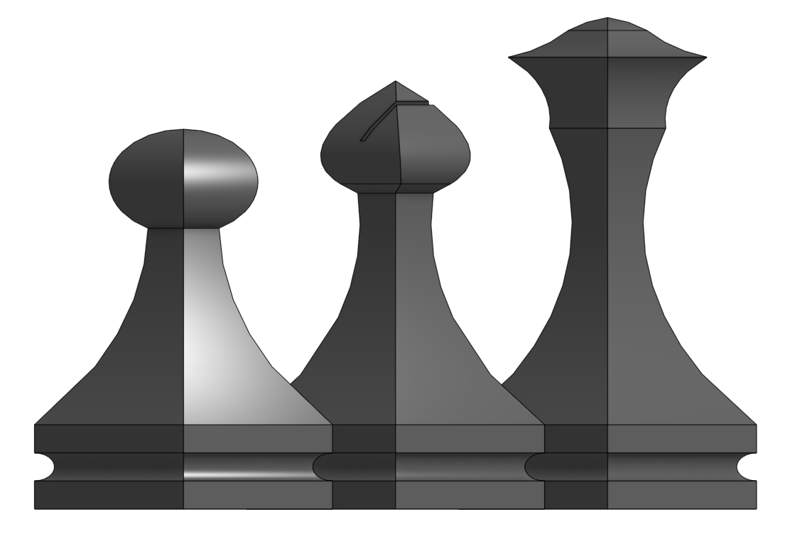
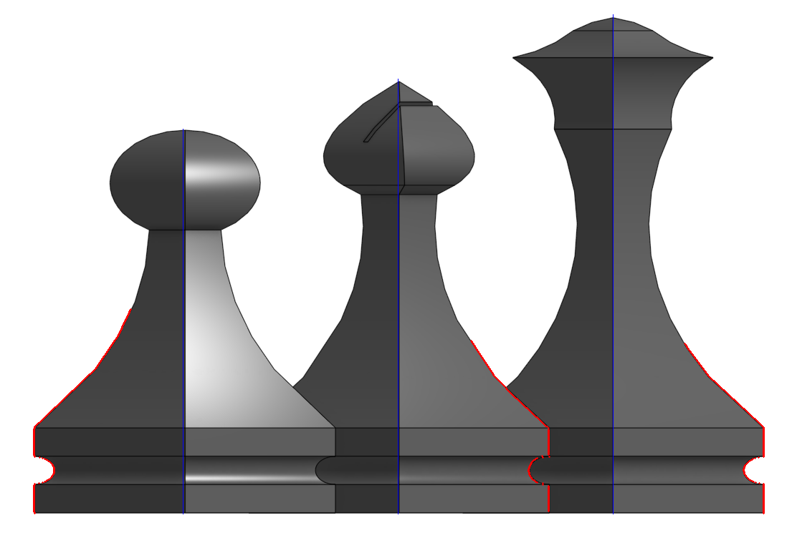
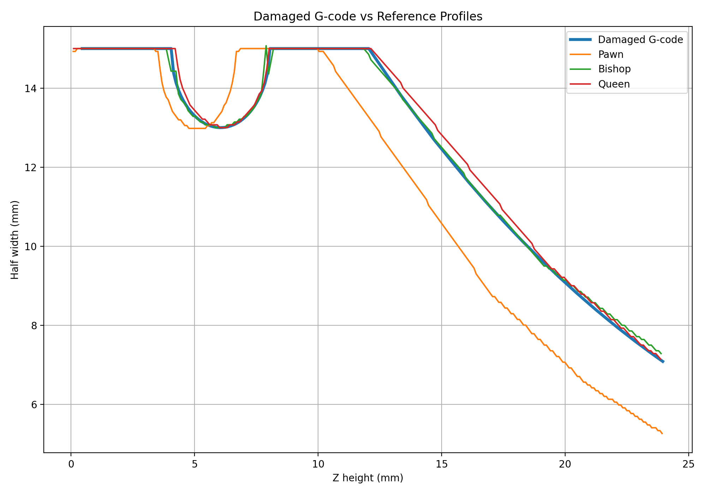
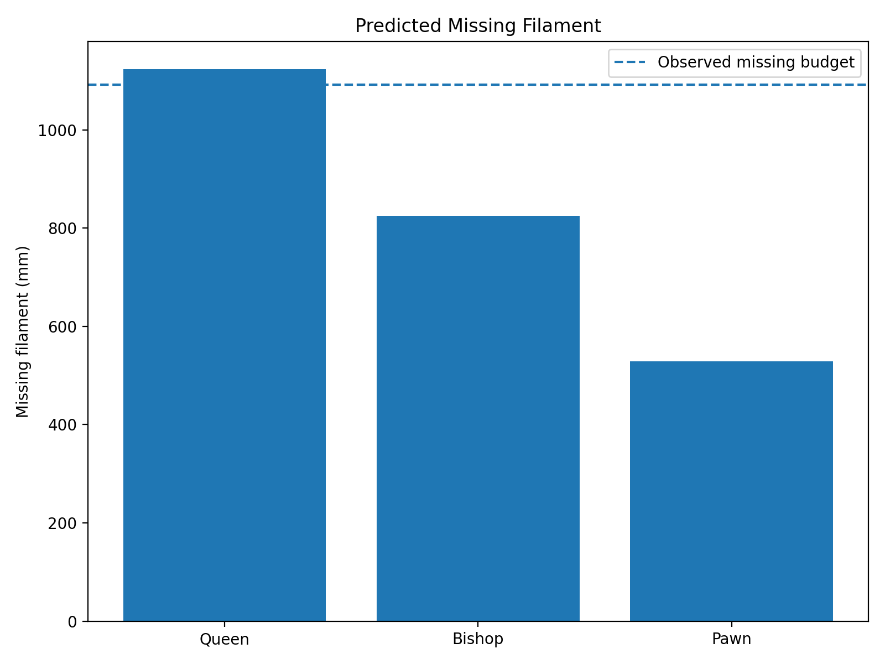

# HACK3D HW1 — Damaged Chess G-code Identification

This project analyzes a damaged chess-piece G-code file and evaluates whether the original model is a **Pawn, Bishop, or Queen**.

The analysis combines:

- G-code parsing and deposition-path extraction
- Layer-by-layer geometry reconstruction
- Reference-profile extraction from the supplied chess image
- RMSE-based geometry comparison
- Sensitivity analysis
- Missing-filament prediction

The final result shows that the preserved lower geometry is closest to the **Bishop**, while the missing-filament evidence strongly favors the **Queen**. When both evidence sources are considered, the **Queen is the most plausible target**.

---

## Project Workflow

```text
damaged_chess.gcode
        |
        v
G-code cleaning
        |
        v
Deposition-only toolpaths
        |
        v
Layer geometry extraction
        |
        +---------------- Reference chess image
        |                         |
        |                         v
        |                Reference profiles
        |                         |
        +---------------- Geometry comparison
                                  |
                                  v
                          RMSE / sensitivity
                                  |
                                  v
                       Missing-filament analysis
                                  |
                                  v
                          Final identification
```

---

## Repository Structure

```text
HW_1_Damaged_Chess/
|
|-- data/
|   |
|   |-- Raw/
|   |   |-- chess_pieces.png
|   |   |-- damaged_chess.gcode
|   |   `-- image_info.txt
|   |
|   |-- Processed/
|   |   |-- clean_deposition.csv
|   |   |-- damaged_layer_profile.csv
|   |   |-- damaged_profile.csv
|   |   |-- reference_profiles.csv
|   |   `-- upper_reference_profiles.csv
|   |
|   `-- Result/
|       |-- baseline_geometry_results.csv
|       |-- comparison_results.csv
|       |-- filament_prediction_results.csv
|       `-- sensitivity_results.csv
|
|-- figures/
|   |-- contour_check.png
|   |-- filament_prediction.png
|   |-- geometry_comparison.png
|   `-- profile_comparison.png
|
|-- src/
|   |-- analyze.py
|   |-- clean_gcode.py
|   |-- compare.py
|   |-- extract.py
|   `-- full_analysis.py
|
|-- GCode_Identification_Report.docx
|-- LICENSE
`-- README.md
```

---

## Raw Data

Original input files are stored in [`data/Raw`](data/Raw).

- [`damaged_chess.gcode`](data/Raw/damaged_chess.gcode) — original damaged G-code
- [`chess_pieces.png`](data/Raw/chess_pieces.png) — Pawn, Bishop, and Queen reference image
- [`image_info.txt`](data/Raw/image_info.txt) — supplied chess-piece height information

Reference heights:

| Piece | Height |
|---|---:|
| Pawn | 45 mm |
| Bishop | 60 mm |
| Queen | 70 mm |

---

## Processed Data

Intermediate datasets are stored in [`data/Processed`](data/Processed).

- [`clean_deposition.csv`](data/Processed/clean_deposition.csv) — deposition-only G-code movements
- [`damaged_layer_profile.csv`](data/Processed/damaged_layer_profile.csv) — layer-by-layer geometry from the damaged G-code
- [`damaged_profile.csv`](data/Processed/damaged_profile.csv) — simplified damaged-piece geometry profile
- [`reference_profiles.csv`](data/Processed/reference_profiles.csv) — extracted Pawn, Bishop, and Queen reference profiles
- [`upper_reference_profiles.csv`](data/Processed/upper_reference_profiles.csv) — upper reference geometry used for filament prediction

---

## Results

Final numerical results are stored in [`data/Result`](data/Result).

- [`baseline_geometry_results.csv`](data/Result/baseline_geometry_results.csv) — baseline geometry comparison
- [`comparison_results.csv`](data/Result/comparison_results.csv) — profile comparison metrics
- [`sensitivity_results.csv`](data/Result/sensitivity_results.csv) — sensitivity-analysis results
- [`filament_prediction_results.csv`](data/Result/filament_prediction_results.csv) — missing-filament predictions

---

## Source Code

Python scripts are stored in [`src`](src).

- [`clean_gcode.py`](src/clean_gcode.py) — cleans the original G-code and extracts deposition movements
- [`extract.py`](src/extract.py) — extracts reference geometry from the chess-piece image
- [`compare.py`](src/compare.py) — compares the damaged geometry with the reference profiles
- [`full_analysis.py`](src/full_analysis.py) — performs the complete geometry, sensitivity, and filament analysis
- [`analyze.py`](src/analyze.py) — additional G-code inspection and visualization

---

# Method

## 1. G-code Cleaning

The original G-code contains multiple types of printer commands, including:

- deposition moves
- travel moves
- retractions
- Z movements
- extrusion-state resets

The parser tracks:

- X position
- Y position
- Z position
- extrusion position E
- absolute and relative positioning
- G92 extrusion resets

A movement is classified as material deposition when:

```text
XY movement > 0
and
Delta E > 0
```

The cleaned deposition data are stored in:

[`clean_deposition.csv`](data/Processed/clean_deposition.csv)

---

## 2. Damaged Geometry Extraction

The deposition paths are grouped by printing height Z.

For each layer, the outer dimensions are measured and converted to a half-width profile:

```math
a(z)=\frac{X_{\max}(z)-X_{\min}(z)}{2}
```

This creates a geometric representation of the preserved part:

```text
Z height -> Half-width
```

The damaged G-code preserves the model only up to approximately:

**Z = 23.95 mm**

The processed layer geometry is available in:

[`damaged_layer_profile.csv`](data/Processed/damaged_layer_profile.csv)

---

## 3. Reference Profile Extraction

The supplied reference image contains all three candidate pieces:



The image is used to extract geometry profiles for:

- Pawn
- Bishop
- Queen

The contour-detection result was visually checked:



The image coordinates were converted from pixels to millimeters.

Each candidate was represented in the same format as the damaged G-code:

```text
Z height -> Half-width
```

The extracted profiles are available in:

[`reference_profiles.csv`](data/Processed/reference_profiles.csv)

---

## 4. Geometry Comparison

The damaged profile is compared against the Pawn, Bishop, and Queen reference profiles over the preserved height range.

The main comparison metric is Root Mean Square Error (RMSE):

```math
RMSE =
\sqrt{
\frac{1}{N}
\sum_{i=1}^{N}
\left(
a_{\mathrm{damaged}}(z_i)
-
a_{\mathrm{reference}}(z_i)
\right)^2
}
```

### Geometry Results

| Candidate | RMSE |
|---|---:|
| **Bishop** | **0.1040 mm** |
| Queen | 0.1882 mm |
| Pawn | 1.4866 mm |

The geometry comparison therefore favors the **Bishop**.

The Pawn is significantly less consistent with the preserved geometry.



Detailed results:

[`baseline_geometry_results.csv`](data/Result/baseline_geometry_results.csv)

---

## 5. Sensitivity Analysis

The geometry comparison depends partly on image calibration and alignment.

To test whether the result remains stable, the analysis varies:

- surface offset
- vertical Z alignment

The results are stored in:

[`sensitivity_results.csv`](data/Result/sensitivity_results.csv)

Across most tested parameter combinations, the **Bishop remains the best lower-geometry match**.

However, the Queen remains sufficiently close that the preserved geometry alone is not considered decisive.

---

## 6. Missing-Filament Analysis

The original G-code metadata indicates an expected total filament usage of approximately:

```text
4290.7 mm
```

The remaining material deposition in the damaged G-code is approximately:

```text
3198.14 mm
```

The missing filament budget is therefore:

```math
F_{\mathrm{missing}}
=
F_{\mathrm{metadata}}
-
F_{\mathrm{existing}}
```

Using the measured values:

```math
F_{\mathrm{missing}}
=
4290.7
-
3198.14
```

Therefore:

```math
F_{\mathrm{missing}}
\approx
1092.56\ \mathrm{mm}
```

The complete upper geometry of each candidate was then used to estimate how much additional filament would be required.

### Predicted Missing Filament

| Candidate | Predicted Missing Filament | Error vs. Observed |
|---|---:|---:|
| **Queen** | **~1124 mm** | **~2.9%** |
| Bishop | ~825 mm | ~24.5% |
| Pawn | ~528 mm | ~51.6% |

Detailed results:

[`filament_prediction_results.csv`](data/Result/filament_prediction_results.csv)



The dashed line represents the observed missing-filament budget.

The Queen prediction is substantially closer to the missing-filament value than the Bishop or Pawn predictions.

---

# Final Interpretation

The geometry and filament analyses provide two independent forms of evidence.

| Evidence | Pawn | Bishop | Queen |
|---|---|---|---|
| Preserved lower geometry | Poor match | **Best match** | Close match |
| Missing filament | Poor match | Moderate mismatch | **Best match** |

Geometry alone slightly favors the **Bishop**.

However, only the lower **23.95 mm** of the original model is preserved, where the Bishop and Queen have similar body profiles.

The missing-filament analysis provides stronger separation between the candidates.

Observed missing filament:

```math
F_{\mathrm{missing}}
\approx
1092.56\ \mathrm{mm}
```

Queen prediction:

```math
F_{\mathrm{Queen}}
\approx
1124\ \mathrm{mm}
```

Bishop prediction:

```math
F_{\mathrm{Bishop}}
\approx
825\ \mathrm{mm}
```

Pawn prediction:

```math
F_{\mathrm{Pawn}}
\approx
528\ \mathrm{mm}
```

The Queen differs from the observed missing-filament budget by only about:

```math
\mathrm{Error}_{\mathrm{Queen}}
\approx
2.9\%
```

Therefore, when both geometry and filament evidence are considered:

> **The Queen is the most plausible original chess piece.**

This conclusion represents a consistency-based identification rather than proof of exact byte-for-byte recovery of the original G-code.

---

## Figures

Generated figures are stored in [`figures`](figures).

- [`contour_check.png`](figures/contour_check.png)
- [`geometry_comparison.png`](figures/geometry_comparison.png)
- [`profile_comparison.png`](figures/profile_comparison.png)
- [`filament_prediction.png`](figures/filament_prediction.png)

---

## Full Report

A formatted report describing the analysis is available here:

### [Download the G-code Identification Report](GCode_Identification_Report.docx)

---

## Requirements

The analysis uses Python and the following packages:

- NumPy
- Matplotlib
- OpenCV

Install the required packages with:

```bash
pip install numpy matplotlib opencv-python
```

---

## Reproducibility

The complete analysis pipeline is implemented in:

[`src/full_analysis.py`](src/full_analysis.py)

The main workflow is:

```text
clean_gcode.py
      |
      v
extract.py
      |
      v
compare.py
      |
      v
full_analysis.py
```

The repository retains:

- original input files
- cleaned G-code data
- extracted geometry profiles
- numerical comparison results
- sensitivity-analysis results
- figures
- final report

This allows each stage of the analysis to be inspected independently.

---

## Limitations

- The candidate geometry is extracted from a raster reference image rather than original CAD/STL models.
- Pixel-to-millimeter calibration introduces measurement uncertainty.
- Only the lower 23.95 mm of the damaged piece is directly preserved.
- Missing-filament prediction depends on assumptions derived from the preserved extrusion behavior.
- The analysis identifies the most plausible candidate but does not prove exact recovery of the original toolpath.

---

## License

See [`LICENSE`](LICENSE).
