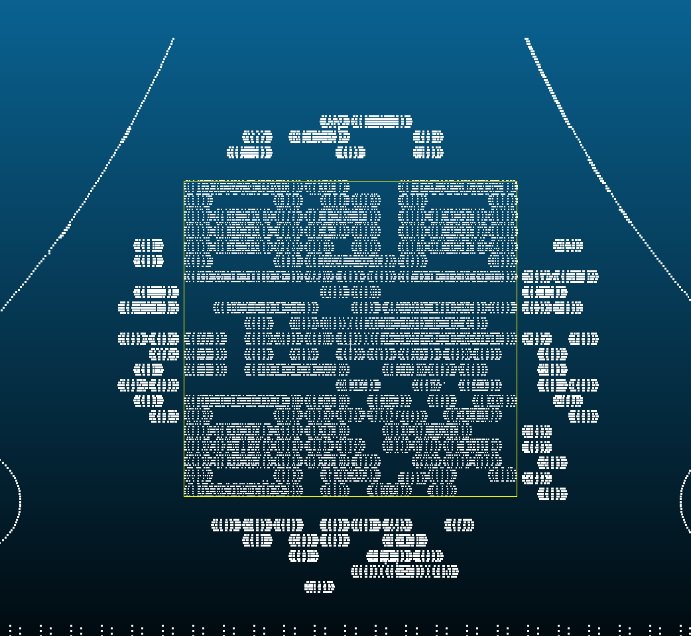
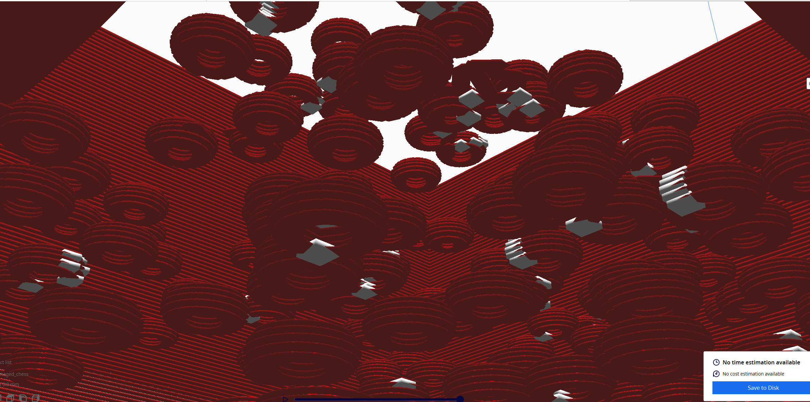
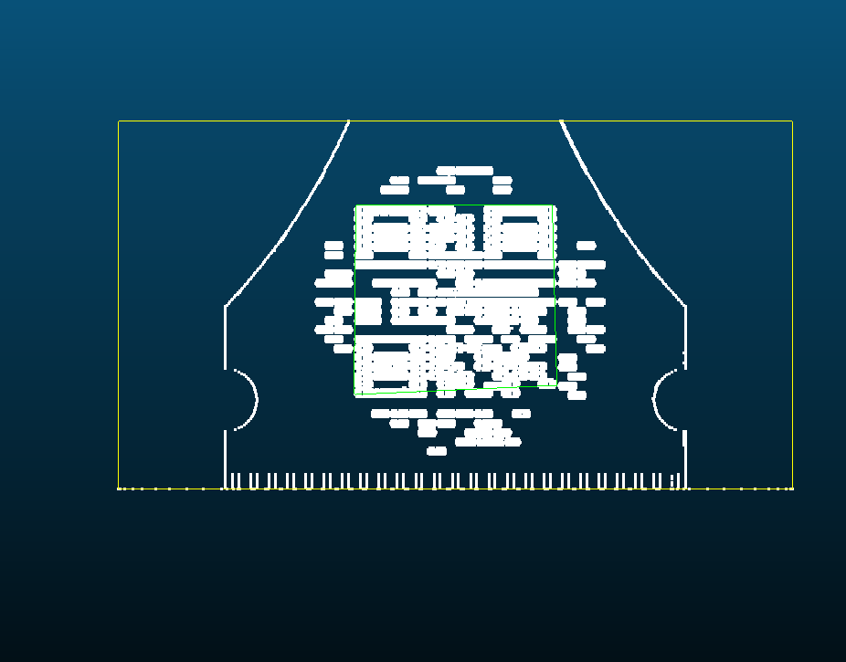
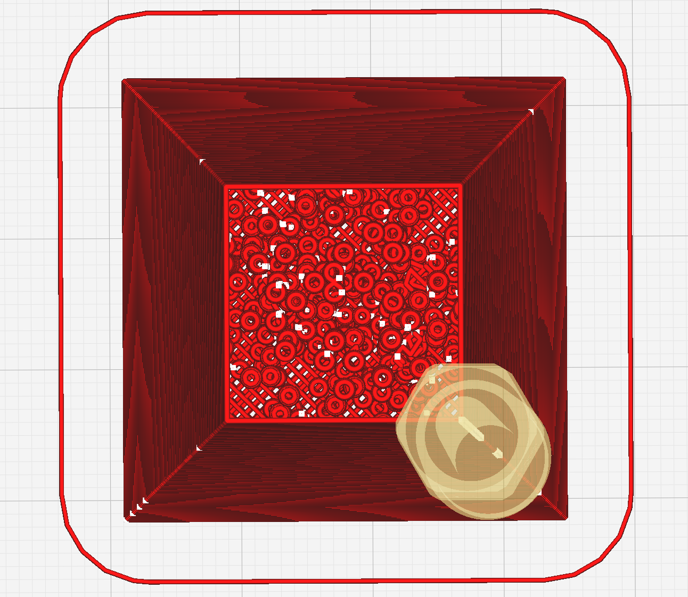
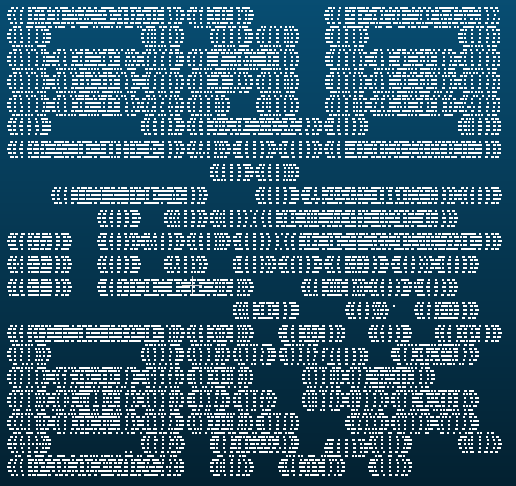
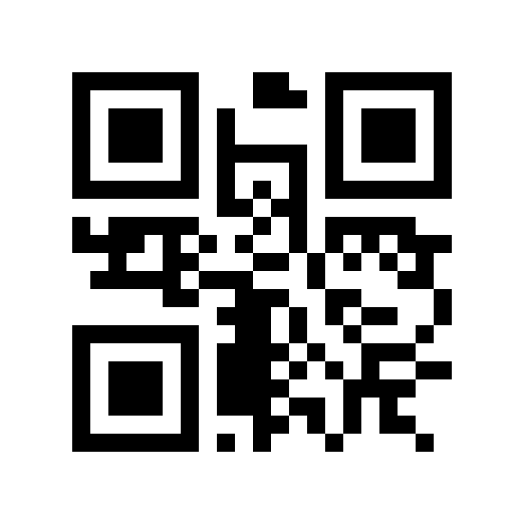

# Damaged G-code QR Recovery

This project recovers a hidden QR code from a damaged 3D-printing G-code file.

## 1. Initial Inspection

The damaged G-code was first inspected using **UltiMaker Cura** and **CloudCompare** to visualize the 3D structure and locate the hidden pattern.

[](Chess_package_2/figures/1.png)

[](Chess_package_2/figures/2.png)

[](Chess_package_2/figures/3.png)

---

## 2. Convert G-code to XYZ

[`001_gcode_to_xyz.py`](Chess_package_2/src/001_gcode_to_xyz.py)

The script extracts extrusion coordinates from:

```text
Chess_package_2/src/Raw/damaged_chess.gcode
```

and generates:

```text
Chess_package_2/data/001_damaged_chess.xyz
```

---

## 3. Analyze the 3D Geometry

[`002_angle_scan.py`](Chess_package_2/src/002_angle_scan.py)

The XYZ point cloud is projected from different viewing angles to reveal the hidden QR structure.

### 3D View

[](Chess_package_2/figures/3D.png)

---

## 4. Calibrate the QR Grid

[`003_calibrate_qr_grid.py`](Chess_package_2/src/003_calibrate_qr_grid.py)

The detected geometry is mapped onto a standard Version 1 QR grid with:

```text
21 × 21 modules
```

Input:

```text
Chess_package_2/data/loop_centers.xyz
```

### Reconstructed QR Pattern

[](Chess_package_2/figures/qr_code_original.png)

---

## 5. Repair the QR Code

[`004_repair_qr.py`](Chess_package_2/src/004_repair_qr.py)

The damaged QR data is recovered using:

- QR format analysis
- Mask detection
- Zig-zag data extraction
- Reed-Solomon error correction
- Additional damaged-bit recovery

Recovered parameters:

```text
Error Correction Level: M
Mask Pattern: 2
Extra Modified Bit: 109
QR Module Position: (14, 11)
```

Recovered QR content:

```text
is.gd/19hak3
```

---

## 6. Generate the Final QR Code

[`005_make_recover.py`](Chess_package_2/src/005_make_recover.py)

The recovered payload is used to generate a clean and scannable QR code.

### Final Recovered QR

[](Chess_package_2/figures/recovered_qr.png)

Recovered content:

```text
is.gd/19hak3
```

---

## Project Structure

```text
Chess_package_2/
│
├── data/
│   ├── 001_damaged_chess.xyz
│   └── loop_centers.xyz
│
├── figures/
│   ├── 1.png
│   ├── 2.png
│   ├── 3.png
│   ├── 3D.png
│   ├── qr_code_original.png
│   └── recovered_qr.png
│
├── src/
│   ├── Raw/
│   │   ├── chess_pieces.png
│   │   ├── damaged_chess.gcode
│   │   └── image_info.txt
│   │
│   ├── 001_gcode_to_xyz.py
│   ├── 002_angle_scan.py
│   ├── 003_calibrate_qr_grid.py
│   ├── 004_repair_qr.py
│   └── 005_make_recover.py
│
├── LICENSE
└── README.md
```

---

## Workflow

```text
damaged_chess.gcode
        ↓
001_gcode_to_xyz.py
        ↓
001_damaged_chess.xyz
        ↓
002_angle_scan.py
        ↓
3D / projection analysis
        ↓
loop_centers.xyz
        ↓
003_calibrate_qr_grid.py
        ↓
damaged 21 × 21 QR matrix
        ↓
004_repair_qr.py
        ↓
is.gd/19hak3
        ↓
005_make_recover.py
        ↓
recovered_qr.png
```

---

## Requirements

```bash
python -m pip install numpy pillow opencv-python reedsolo "qrcode[pil]"
```

---

## Run

```bash
python Chess_package_2/src/001_gcode_to_xyz.py
python Chess_package_2/src/002_angle_scan.py
python Chess_package_2/src/003_calibrate_qr_grid.py
python Chess_package_2/src/004_repair_qr.py
python Chess_package_2/src/005_make_recover.py
```
